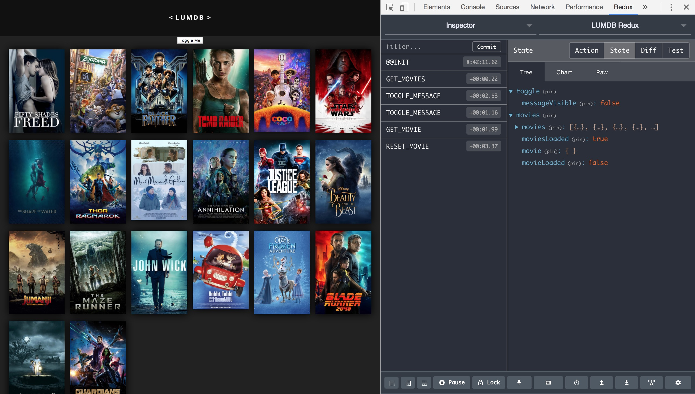

# LUMDB Redux - Level Up Movie Database with Redux



## Introduction

LUMDB is a React app that lists the most popular movies from [The Movie DB](https://www.themoviedb.org/) and displays details of a movie when its poster is clicked.

This app is based on my [LUMDB project](https://github.com/ashdavis/lumdb), but builds on that project by adding Redux to organise application state.

The app was created while completing the [Redux & React for Everyone](https://www.leveluptutorials.com/tutorials/redux-and-react-for-everyone), a React course by [Level Up Tutorials](https://www.leveluptutorials.com).


## Project Features

- A modern web app built using React 16 and modern JavaScript (ES2015 and beyond)
- State management using Redux and React Redux
- Routing with React Router 4
- Styled Components
- Fetching API data using the Thunk middleware for Redux, Async / Await and the Fetch API
- Redux logging using the Redux Logger middleware
- Configured to connect to the Redux DevTools Extension
- Functional and class components, with markup written in JSX
- Communication between components using props
- Transitions using react-overdrive
- create-react-app for Webpack tooling
- Project organisation using feature folders


## How to Use

### Prerequisites

The app communicates with The Movie DB API via a Node.js server. Clone the [lumdb-api](https://github.com/ashdavis/lumdb-api) project, follow the setup instructions and ensure the server is running locally.

By default, the app looks for a `REACT_APP_API_URL` environment variable to set the API URL for the production environment. The URL is set to `http://localhost:8080` for all other environments.

To set the API URL for production, add your production URL to the `REACT_APP_API_URL` variable in the `.env` file at the root of the project.

The logic for setting the API URL can be found in `/src/api-config.js`.

### Develop

```sh
npm start
```

Runs the app in development mode.<br>
Open [http://localhost:3000](http://localhost:3000) to view it in the browser.

The page will automatically reload if you make changes to the code.<br>
You will see the build errors and lint warnings in the console.

### Production

```sh
npm run build
```

Builds the app for production to the `build` folder.<br>
It correctly bundles React in production mode and optimizes the build for the best performance.

The build is minified and the filenames include the hashes.<br>
By default, it also [includes a service worker](./docs/create-react-app-readme.md#making-a-progressive-web-app) so that the app loads from local cache on future visits.

### More information

For more create-react-app commands, see the create-react-app [README](./docs/create-react-app-readme.md).


## Technology Used

- [React 16](https://reactjs.org)
- [Redux](https://redux.js.org/)
- [React Redux](https://github.com/reactjs/react-redux)
- [Redux DevTools Extension](https://github.com/zalmoxisus/redux-devtools-extension)
- [Redux Thunk](https://github.com/gaearon/redux-thunk)
- [Redux Logger](https://github.com/evgenyrodionov/redux-logger)
- [React Router 4](https://reacttraining.com/react-router/)
- [React Overdrive](https://github.com/berzniz/react-overdrive)
- [Styled Components](https://www.styled-components.com/)
- [The Movie DB API](https://www.themoviedb.org/documentation/api)


## Contributors

### Development

- Ashley Davis
